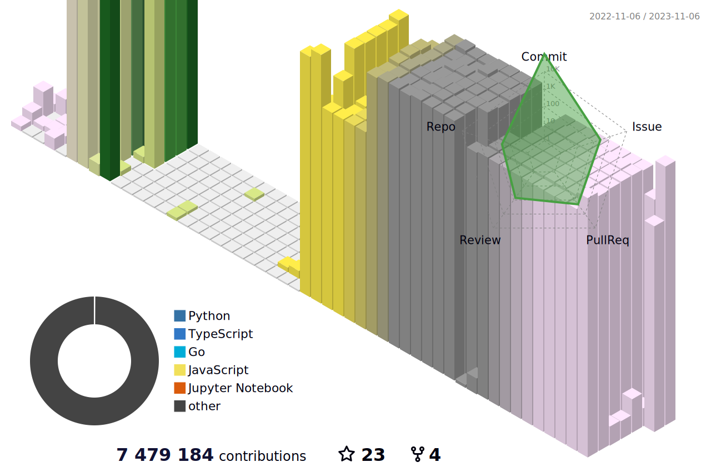
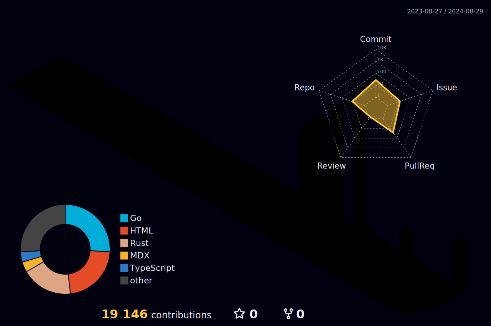

<h2 align="center">Pioneering Decentralized Compute Marketplaces | OSS Engineer | Polyglot ⚡Go, Python, JS | 💪 with AI,ML | 🪔 Web3 Adovocate </h2>
<!--For Coders... <h4 align="justify">I am a Backend Engineer. I kill time working on projects. I enjoy Problem-Solving (DS,Algo, Chess), AI Prompting & Automation for fun</h4> -->

<!--  -->
<!-- 
 -->

<!--  -->

<!-- 
  
 -->

 

- 🔭 Pioneering **Bleeding/Cutting Edge** Tech
- 🌱 Discovering **Quantum Computing, Zkproofs** ⚡ 
- 👯 I’m looking to collaborate on **ML, AI, Web3, Zkproofs** 
<!-- - 🤝 I’m looking for peer learners & experts on **Quantum Computing, ML** -->
- 👨‍💻 Checkout my projects @ <b> [Nasfame](https://github.com/Nasfame), [Web3Musketeers](https://github.com/CoopHive/), [DecenterAI](https://github.com/DeCenter-AI/) </b>
- 💬 Ask me your doubts on **OSS,Go, Python, Javascript,BE (Backend)** 📝 
- 🥅 2024 Goals: Build **Quantum Zkproofs**, <b> Multi-modal(video,audio,text) ML **AGI** model </b>
  <!-- - 💻 Coding/Programming - [@Nasfame](https://github.com/Nasfame) -->
<!-- - 📫 Reach me @ <a href="mailto:laciferin@gmail.com"> Send Mail</a> -->
- 👯 Fun fact **AGI I am gonna build @ 2024 will be better than me @ coding**
<!-- 
<h3 align="left">Languages and Tools:</h3>

                  -->

[//]: # (
)
<!-- 
[//]: # (
)
  
  
  
  
  
  
  
  

 -->

<!-- 

 -->
<!-- 

 
 -->

 ## ⭐ My Latest projects

* [CoopHive: Decentralized Compute Protocol](https://github.com/CoopHive/hive) 
* [🍃 Lilypad: Decentralized AI Inference Protocol](https://github.com/bacalhau-project/lilypad)
* [Bacalhau: Decentralized Compute Network](https://github.com/bacalhau-project/bacalhau)
* [open-source-chat: Documentation Chatbot](https://devpost.com/software/oschat)
* [DecenterAI-PoC](https://github.com/DeCenter-AI/decenter-ai.streamlit.app)
* [DecenterAI](https://github.com/DeCenter-AI/app.decenterai.com/)
* [DBResolver-Golang Database Resolver and Wrapper for any multiple database connections](https://github.com/bxcodec/dbresolver)
* [Web3Sub: Decentralized Web3 Users Management Protocol](https://github.com/Web3Mustketeers/web3.sub)

## ⚡ Recent Activity
<!--START_SECTION:activity-->
1. 🔒 Closed issue [#4494](https://github.com/warpdotdev/Warp/issues/4494) in [warpdotdev/Warp](https://github.com/warpdotdev/Warp)
2. 🗣 Commented on [#4494](https://github.com/warpdotdev/Warp/issues/4494#issuecomment-1982186653) in [warpdotdev/Warp](https://github.com/warpdotdev/Warp)
3. ❗ Opened issue [#4494](https://github.com/warpdotdev/Warp/issues/4494) in [warpdotdev/Warp](https://github.com/warpdotdev/Warp)
4. 🗣 Commented on [#753](https://github.com/warpdotdev/Warp/issues/753#issuecomment-1982014529) in [warpdotdev/Warp](https://github.com/warpdotdev/Warp)
5. 💪 Opened PR [#4](https://github.com/CoopHive/coophive-module-sdxl/pull/4) in [CoopHive/coophive-module-sdxl](https://github.com/CoopHive/coophive-module-sdxl)
6. 💪 Opened PR [#3](https://github.com/CoopHive/coophive-module-sdxl/pull/3) in [CoopHive/coophive-module-sdxl](https://github.com/CoopHive/coophive-module-sdxl)
7. 🎉 Merged PR [#2](https://github.com/CoopHive/coophive-module-sdxl/pull/2) in [CoopHive/coophive-module-sdxl](https://github.com/CoopHive/coophive-module-sdxl)
8. 🗣 Commented on [#2](https://github.com/CoopHive/coophive-module-sdxl/pull/2#issuecomment-1974943702) in [CoopHive/coophive-module-sdxl](https://github.com/CoopHive/coophive-module-sdxl)
9. 💪 Opened PR [#2](https://github.com/CoopHive/coophive-module-sdxl/pull/2) in [CoopHive/coophive-module-sdxl](https://github.com/CoopHive/coophive-module-sdxl)
10. 🗣 Commented on [#54](https://github.com/bxcodec/dbresolver/pull/54#issuecomment-1968799001) in [bxcodec/dbresolver](https://github.com/bxcodec/dbresolver)
11. 🗣 Commented on [#54](https://github.com/bxcodec/dbresolver/pull/54#issuecomment-1968796692) in [bxcodec/dbresolver](https://github.com/bxcodec/dbresolver)
12. 🗣 Commented on [#54](https://github.com/bxcodec/dbresolver/pull/54#issuecomment-1968776554) in [bxcodec/dbresolver](https://github.com/bxcodec/dbresolver)
13. 🗣 Commented on [#54](https://github.com/bxcodec/dbresolver/pull/54#issuecomment-1968774049) in [bxcodec/dbresolver](https://github.com/bxcodec/dbresolver)
14. 🗣 Commented on [#54](https://github.com/bxcodec/dbresolver/pull/54#issuecomment-1968770625) in [bxcodec/dbresolver](https://github.com/bxcodec/dbresolver)
15. 🗣 Commented on [#348](https://github.com/rs/zerolog/issues/348#issuecomment-1968717937) in [rs/zerolog](https://github.com/rs/zerolog)
<!--END_SECTION:activity-->

## 📬 Connect with me:

&nbsp;
&nbsp;
&nbsp;
&nbsp;
&nbsp;
&nbsp;

<!-- TODO: when changing the below image make sure that u r updating the ci: L67 -->

<!--   -->
