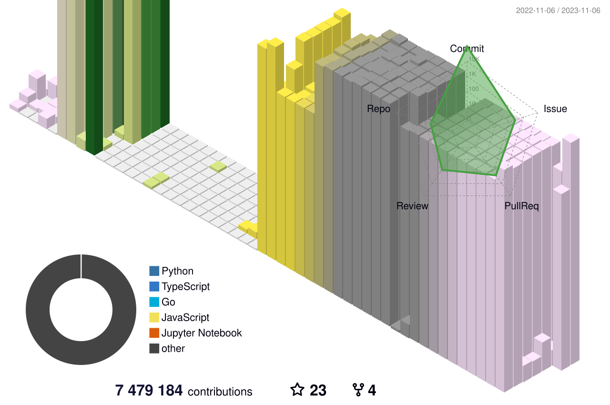
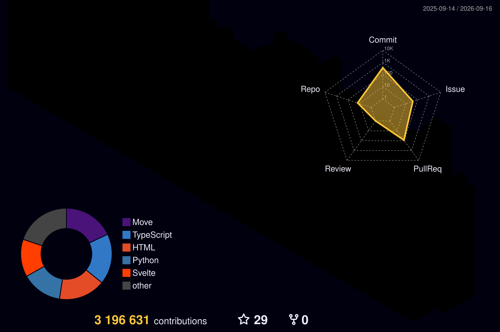

<h2 align="center">Pioneering Decentralized Compute Marketplaces | OSS Engineer | Polyglot ⚡Go, Python, JS | 💪 with AI,ML | 🪔 Web3 Adovocate </h2>
<!--For Coders... <h4 align="justify">I am a Backend Engineer. I kill time working on projects. I enjoy Problem-Solving (DS,Algo, Chess), AI Prompting & Automation for fun</h4> -->

<!--  -->
<!--
 -->

<!--  -->

<!-- 
  
 -->

 

- 🔭 Pioneering **Bleeding/Cutting Edge** Tech
- 🌱 Discovering **Quantum Computing, Zkproofs** ⚡
- 👯 I’m looking to collaborate on **ML, AI, Web3, Zkproofs**
<!-- - 🤝 I’m looking for peer learners & experts on **Quantum Computing, ML** -->
- 👨‍💻 Checkout my projects @ <b> [laciferin2024](https://github.com/laciferin2024), [Web3Musketeers](https://github.com/CoopHive/), [DecenterAI](https://github.com/DeCenter-AI/) </b>
- 💬 Ask me your doubts on **OSS,Go, Python, Javascript,BE (Backend)** 📝
- 🥅 2024 Goals: Build **Quantum Zkproofs**, <b> Multi-modal(video,audio,text) ML **AGI** model </b>
    <!-- - 💻 Coding/Programming - [@laciferin2024](https://github.com/laciferin2024) -->
  <!-- - 📫 Reach me @ <a href="mailto:laciferin@gmail.com"> Send Mail</a> -->
- 👯 Fun fact **AGI I am gonna build @ 2024 will be better than me @ coding**
<!--
<h3 align="left">Languages and Tools:</h3>

                  -->

[//]: # "
"

<!--
[//]: # (
)
  
  
  
  
  
  
  
  

 -->

<!-- 

 -->
<!--

 
 -->

## ⭐ My Latest projects

- [CoopHive: Decentralized Compute Protocol](https://github.com/CoopHive/hive)
- [🍃 Lilypad: Decentralized AI Inference Protocol](https://github.com/bacalhau-project/lilypad)
- [Bacalhau: Decentralized Compute Network](https://github.com/bacalhau-project/bacalhau)
- [open-source-chat: Documentation Chatbot](https://devpost.com/software/oschat)
- [DecenterAI-PoC](https://github.com/DeCenter-AI/decenter-ai.streamlit.app)
- [DecenterAI](https://github.com/DeCenter-AI/app.decenterai.com/)
- [DBResolver-Golang Database Resolver and Wrapper for any multiple database connections](https://github.com/bxcodec/dbresolver)
- [Web3Sub: Decentralized Web3 Users Management Protocol](https://github.com/Web3Mustketeers/web3.sub)

## ⚡ Recent Activity

<!--START_SECTION:activity-->

1. ❗ Opened issue [#55](https://github.com/context-labs/mactop/issues/55) in [context-labs/mactop](https://github.com/context-labs/mactop)
2. 💪 Opened PR [#13](https://github.com/context-labs/uwu/pull/13) in [context-labs/uwu](https://github.com/context-labs/uwu)
3. 💪 Opened PR [#265](https://github.com/unreal-art/art/pull/265) in [unreal-art/art](https://github.com/unreal-art/art)
4. 💪 Opened PR [#264](https://github.com/unreal-art/art/pull/264) in [unreal-art/art](https://github.com/unreal-art/art)
5. 🗣 Commented on [#21137](https://github.com/oven-sh/bun/issues/21137#issuecomment-3173144668) in [oven-sh/bun](https://github.com/oven-sh/bun)
6. 🗣 Commented on [#21137](https://github.com/oven-sh/bun/issues/21137#issuecomment-3173143864) in [oven-sh/bun](https://github.com/oven-sh/bun)
7. 🗣 Commented on [#21137](https://github.com/oven-sh/bun/issues/21137#issuecomment-3173136098) in [oven-sh/bun](https://github.com/oven-sh/bun)
8. 💪 Opened PR [#263](https://github.com/unreal-art/art/pull/263) in [unreal-art/art](https://github.com/unreal-art/art)
9. 💪 Opened PR [#262](https://github.com/unreal-art/art/pull/262) in [unreal-art/art](https://github.com/unreal-art/art)
10. ❗ Opened issue [#387](https://github.com/flexprice/flexprice/issues/387) in [flexprice/flexprice](https://github.com/flexprice/flexprice)
11. 🗣 Commented on [#5048](https://github.com/bacalhau-project/bacalhau/issues/5048#issuecomment-3150919404) in [bacalhau-project/bacalhau](https://github.com/bacalhau-project/bacalhau)
12. 🗣 Commented on [#802](https://github.com/near/create-near-app/issues/802#issuecomment-3146713788) in [near/create-near-app](https://github.com/near/create-near-app)
13. 💪 Opened PR [#261](https://github.com/unreal-art/art/pull/261) in [unreal-art/art](https://github.com/unreal-art/art)
14. 💪 Opened PR [#258](https://github.com/unreal-art/art/pull/258) in [unreal-art/art](https://github.com/unreal-art/art)
15. 🔒 Closed issue [#245](https://github.com/unreal-art/art/issues/245) in [unreal-art/art](https://github.com/unreal-art/art)
<!--END_SECTION:activity-->

## 📬 Connect with me:

&nbsp;
&nbsp;
&nbsp;
&nbsp;
&nbsp;
&nbsp;

<!-- TODO: when changing the below image make sure that u r updating the ci: L67 -->

<!--   -->
